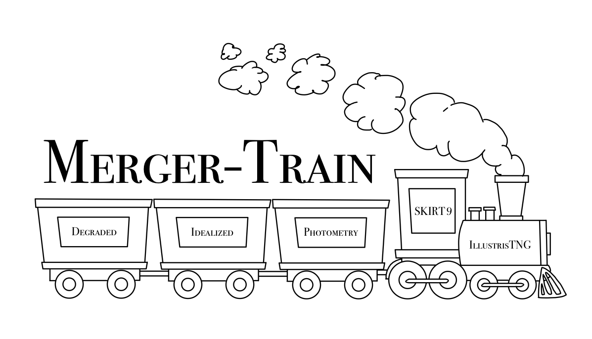

<!-- PROJECT LOGO -->
 

  
  

# Merger Train
Random forest and LDA models trained on SKIRT images of mergers and non-mergers from IllustrisTNG100-1 and the necessary data to train your own.

 - SKIRT contains the r-band photometry generated by the SKIRT pipeline, before any realism is applied. Native to the SKIRT pipeline, the images have a resolution of pixel scale of 0.1 kpc / pix and are redshifted according to a fixed redshift of z = 0.1.

 - Idealized contains the images rebinned to match the degraded images, but without PSF blurring and minimal sky noise. 

- Degraded contains the images degraded to various image qualities. The image quality can be drawn directly from the file name. 
